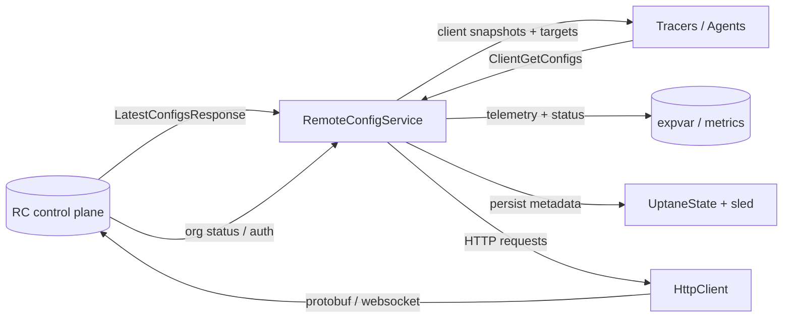
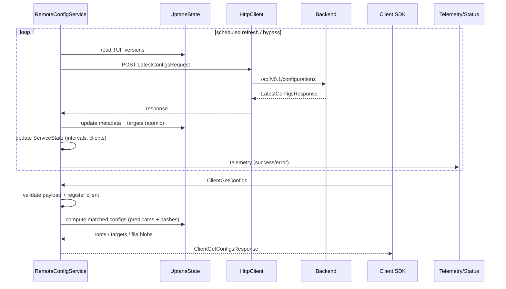

# remote-config-core

> A Rust implementation of the Datadog Remote Configuration service that mirrors the Go agent feature-for-feature while staying embedder-agnostic.

## Contents

1. [Why this crate exists](#why-this-crate-exists)
2. [How Remote Config works](#how-remote-config-works)
3. [Architecture overview](#architecture-overview)
4. [TUF / Uptane implementation](#tuf--uptane-implementation)
5. [Component responsibilities](#component-responsibilities)
6. [Using the crate](#using-the-crate)
7. [Operational notes](#operational-notes)
8. [Limitations](#limitations)
9. [Testing & contributing](#testing--contributing)

## Why this crate exists

Datadog Remote Configuration (RC) lets tracers, agents, and other workloads receive signed configuration bundles without restarts. The official Go agent exposes the service under `pkg/config/remote/service`. `remote-config-core` ports that behaviour to Rust so Bottlecap, mini agents, and bespoke services can reuse a single, well-tested core instead of re-implementing protocol details.

The crate focuses on:

- *Parity* – matching the Go implementation’s validation logic, Uptane/TUF handling, and telemetry so behaviour is predictable across languages.
- *Embedder friendliness* – providing bootstrap helpers, credential/runtime watchers, and ergonomic APIs that let hosts add Remote Config with minimal glue code.
- *Trust & resilience* – seeding embedded roots, persisting Uptane metadata in sled, replaying root chains for lagging clients, and surfacing org/credential status exactly like the Go agent.

## How Remote Config works

Remote Config distributes signed payloads (targets) alongside Uptane metadata (`root.json`, `snapshot.json`, `timestamp.json`, `targets.json`). Agents keep a local Uptane cache, periodically fetch updates from the backend (or CDN), and serve downstream clients (`ClientGetConfigs`).

### Actors & interactions



- **Backend** authenticates requests and returns protobuf responses that contain TUF metadata + raw config files.
- **RemoteConfigService** drives polling, persists metadata, performs cache-bypass refreshes, and applies tracer predicates when clients ask for configs.
- **Clients** (tracers, updaters, etc.) declare the products they are interested in and receive only the deltas they require.
- **Observability hooks** expose refresh success/failure, bypass decisions, org enablement, and websocket diagnostics.

### Lifecycle at a glance



## Architecture overview

```
┌────────────────────────────┐
│ bootstrap                  │  ← builds RemoteConfigService + telemetry from env/runtime
└────────────┬───────────────┘
             │
┌────────────▼───────────────┐
│ RemoteConfigService        │  ← orchestration (poller, bypass, client handler, status)
├────────────┬───────────────┤
│ service::* │ http │ status │
└────┬───────┴──────┬────────┘
     │              │
┌────▼────────┐  ┌───▼────────┐
│ Uptane      │  │ HttpClient │  ← reqwest + rustls, protobuf encode/decode, websocket echo
│  (sled)     │  └────┬───────┘
└────┬────────┘       │
     │                │
┌────▼───────┐  ┌─────▼───────┐
│ RcStore    │  │ CDN client  │  ← optional agentless path (50s throttle, Uptane-backed)
└────────────┘  └─────────────┘
```

- **bootstrap** wires environment variables, runtime/credential watchers, sled stores, HTTP clients, and telemetry into a ready-to-use `RemoteConfigService`.
- **service** hosts the public façade (`RemoteConfigService`) plus cache-bypass orchestration, tracer predicate evaluation, websocket echo diagnostics, org-status polling, and telemetry hooks.
- **uptane + store** persist metadata, enforce identity, replay director roots, and expose snapshot diagnostics.
- **http** handles authentication headers, retry classification, and websocket requests with rustls-only TLS.
- **cdn** mirrors the Go `GetCDNConfigUpdate` path for agentless environments.
- **telemetry/status** provide counter-based implementations and expvar-style JSON snapshots.

## TUF / Uptane implementation

The crate keeps Remote Config’s trust story identical to the Go agent while swapping the storage engine for a Rust-friendly stack:

| Aspect | Rust implementation | Go agent reference | Behavioural notes |
| --- | --- | --- | --- |
| Trust anchors | `embedded_roots::resolve()` loads prod/staging/gov JSON blobs (or operator overrides) and verifies `signed.version`. | `pkg/config/remote/meta/meta.go` embeds the same JSON sources. | Payloads are kept byte-for-byte in sync; validation logic is identical. |
| Storage layout | `RcStore` wraps sled with trees `config_repo`, `director_repo`, `target_files`, `org_data`, plus a `meta.json` identity. | Go uses BoltDB buckets with the same names. | Keys/values match exactly so future cross-language tooling (e.g., debugging stores) behaves the same. |
| Uptane updates | `UptaneState::update()` batches config metadata, delegated targets, director metadata, and target files atomically, then prunes stale files. | `pkg/config/remote/state/repository.go` performs the same operations in Bolt transactions. | Both implementations store delegated targets under `delegated/<role>.json` and keep `target:`-prefixed blobs for payloads. |
| Verification | `UptaneState::verify_latest_configs()` rebuilds a `rust-tuf::Database` from sled, replays root chains, and feeds timestamp/snapshot/targets plus delegations through `rust-tuf` using the fixed `tuf_verification_start_time()` epoch before any sled transaction commits. | `pkg/config/remote/uptane/client.go` hydrates the Bolt-backed `go-tuf` clients via `updateRepos()`, letting `go-tuf` walk timestamp→snapshot→targets with wall-clock expiry checks. | Rust defers real-time expiry (timestamp freshness is enforced later in `ClientGetConfigs`) while Go surfaces those errors directly from `go-tuf`. Otherwise both paths reject signature, version, or rollback violations before touching disk. |
| Target parity & payloads | `verify_target_parity()` merges top-level + delegated config targets (including cached delegations) and `build_complete_target_payloads()` recomputes lengths/hashes with `validate_payload_bytes()` for both fresh and cached payloads before they enter the sled batch. | `verifyUptane()` fetches director targets, looks up config metadata via `TargetBatch`, and calls `DownloadBatch()` on both repos so `go-tuf` re-hashes every payload inside Bolt’s target store before pruning. | Rust performs the byte-level checks prior to persistence (catching bad responses even when they include cached fallbacks) whereas Go relies on `DownloadBatch` to verify data already staged in the target store; both fail the update if config and director metadata diverge. |
| Delegated targets reuse | `verify_delegations()` cross-references snapshot-declared delegated versions, applies provided blobs, and otherwise rehydrates `rust-tuf` with cached `delegated/<role>.json` files when the backend omits or downgrades a role, logging when verification must be deferred. | Go’s go-tuf setup keeps previous delegated versions in the remote store maps; if a response omits a role, `go-tuf` continues to use the cached blob during `Update()`. | Rust explicitly compares cached versions against the snapshot expectation before reuse (raising `MissingField` if stale), while Go trusts `go-tuf` to detect mismatches when the snapshot points to a newer version. |
| Root history | `director_roots_since()` replays every director root between two versions so lagging clients can catch up. | `Repository.GetDirectorRootSince()` in Go does the same. | Ensures cache-bypass flows can supply the exact chain the backend expects. |
| Org UUID binding | `org_uuid(root_version)` stores UUIDs per config root version and validates rotations in `service::org`. | Go’s `orgStore` ties UUIDs to root versions with the same semantics. | Prevents stale credentials from being applied to a new org. |
| Diagnostics | `UptaneState::state()` returns a `State` struct with hashes/versions that mirrors Go’s expvar payload. | `pkg/config/remote/state/repository.go` maps Bolt entries into expvar. | Useful for parity assertions/tests. |

**Differences from Go:** aside from sled vs. BoltDB, the Rust path pins verification time to the Unix epoch (so timestamp expiry happens during request serving), verifies delegated metadata versions explicitly before reuse, and performs payload hash checks prior to persistence rather than relying on `DownloadBatch`. Everything else—root seeding, director/config metadata updates, target pruning, org UUID scoping, CDN refresh rules—remains ported line-by-line, and the parity tests (`uptane_update_and_state`, `director_root_history_is_preserved`, CDN throttling tests, etc.) ensure regressions are caught early.

## Limitations

- **Websocket echo compression toggles** – The Go agent flips the websocket write-compression flag whenever the backend sends `set_compress_on/off` frames. `tokio-tungstenite` currently lacks a way to renegotiate compression after the handshake, so the Rust implementation logs the requested state change but keeps the negotiated compression setting for the lifetime of the connection. Connectivity tests still run, but compression-mode parity requires either upstream support or reconnecting when the backend requests a toggle.

## Component responsibilities

| Module | Responsibilities |
| --- | --- |
| `bootstrap` | Reads `RemoteConfigEnv`, manages sled stores, seeds embedded roots, installs telemetry, and exposes `WatchedRemoteConfigRuntime` for `tokio::sync::watch` integration. |
| `service::core` | Public handle for starting/stopping background tasks, handling `ClientGetConfigs`, rotating credentials, and exposing diagnostics. |
| `service::refresh` | Poll loop with exponential backoff, timestamp resolution guard, cache-bypass queue, websocket echo task. |
| `service::client` | Validates client descriptors, cached target hashes, tracer predicates, org ID restrictions, and canonical JSON rendering. |
| `service::state` | Tracks active clients, refresh cadence, org status, websocket outcome, bypass budgets, and error escalation counters. |
| `service::org` | Org status polling, credential rotation (API key / RC key / PAR JWT), org UUID management. |
| `store` | Sled wrapper with metadata identity checks, tree helpers, and safe re-creation when credentials change. |
| `uptane` | Applies `LatestConfigsResponse`, stores delegated targets, prunes stale files, exposes raw metadata + version snapshots, replays director roots. |
| `http` | Rustls reqwest client with header rotation, transport classification, protobuf encode/decode, websocket builder. |
| `cdn` | CDN client with throttled polling, metadata reconstruction, product filtering, and Uptane-backed cache. |
| `telemetry` | Counter-based (`CountingTelemetry`) and fan-out (`CompositeTelemetry`) implementations of the `RemoteConfigTelemetry` trait. |

## Using the crate

### 1. Bootstrapping a service with runtime/credential watchers

```rust
use remote_config_core::bootstrap::{
    CredentialSnapshot, HostRuntimeSnapshot, RemoteConfigBootstrap, StoreMode,
    WatchedRemoteConfigRuntime,
};
use remote_config_core::config::RemoteConfigEnv;
use tokio::sync::watch;

#[tokio::main]
async fn main() -> anyhow::Result<()> {
    // Load environment configuration (DD_REMOTE_CONFIGURATION_* variables).
    let env = RemoteConfigEnv::from_os_env();

    // Bridge your host configuration system through `watch` channels.
    let (_runtime_tx, runtime_rx) = watch::channel(HostRuntimeSnapshot {
        hostname: Some("example-host".into()),
        tags: Some(vec!["env:prod".into()].into()),
        ..Default::default()
    });
    let (_cred_tx, cred_rx) = watch::channel(CredentialSnapshot::new(
        env.api_key.clone().expect("DD_API_KEY required"),
        env.rc_key.clone(),
        env.par_jwt.clone(),
    ));

    let runtime = WatchedRemoteConfigRuntime::new(HostRuntimeSnapshot::default())
        .with_runtime_watch(runtime_rx)
        .with_credentials(CredentialSnapshot::new(
            env.api_key.clone().expect("api key"),
            env.rc_key.clone(),
            env.par_jwt.clone(),
        ))
        .with_credential_watch(cred_rx);

    let bootstrap = RemoteConfigBootstrap {
        env,
        agent_version: "1.0.0",
        agent_uuid: None,
        tags: vec!["service:example".into()],
        store: StoreMode::Persistent("/var/lib/datadog".as_ref()),
        runtime: Some(&runtime),
    };

    let artifacts = bootstrap.build()?;
    let (service, telemetry_counters) = artifacts.install().await;

    // Start background polling (refresh loop + org-status + websocket echo).
    let handle = service.start().await;

    // Expose telemetry/expvar via your metrics stack.
    println!("refresh successes: {}", telemetry_counters.snapshot().refresh_success);

    // Keep the handle around to shut down gracefully on SIGTERM.
    handle.shutdown().await;
    Ok(())
}
```

### 2. Serving downstream `ClientGetConfigs` requests

```rust
use remote_config_core::{handle_client_request, RemoteConfigHost, RemoteConfigService};
use remote_config_proto::remoteconfig::ClientGetConfigsRequest;

struct Host {
    service: RemoteConfigService,
}

impl RemoteConfigHost for Host {
    fn remote_config_service(&self) -> &RemoteConfigService {
        &self.service
    }
}

async fn serve_request(host: &Host, payload: Vec<u8>) -> anyhow::Result<Vec<u8>> {
    let response_bytes = remote_config_core::handle_client_request_bytes(host, &payload).await?;
    Ok(response_bytes)
}

async fn serve_struct(host: &Host, request: ClientGetConfigsRequest) -> anyhow::Result<()> {
    let response = handle_client_request(host, request).await?;
    println!("client received {} target files", response.target_files.len());
    Ok(())
}
```

The helper mirrors the Go agent’s gRPC service: construct either the protobuf struct or raw bytes and let the crate handle validation, tracer predicates, and cache-bypass logic.

### 3. Consuming the CDN in agentless environments

```rust
use remote_config_core::cdn::{CdnClient, CdnClientConfig};

async fn cdn_example() -> Result<(), Box<dyn std::error::Error>> {
    let config = CdnClientConfig {
        site: "https://app.datadoghq.com".into(),
        api_key: "api-key".into(),
        agent_version: "1.0.0".into(),
        ..Default::default()
    };

    // The helper opens (or creates) `remote-config-cdn.db` under the supplied path.
    let client = CdnClient::with_run_path("/var/lib/datadog", config)?;

    if let Some(update) = client
        .get_update(&["APM_TRACING".into()], /*targets*/ 0, /*root*/ 0)
        .await?
    {
        println!("{} configs matched", update.client_configs.len());
    }
    Ok(())
}
```

### 4. Exporting telemetry & status

```rust
use remote_config_core::telemetry::{CountingTelemetry, TelemetryCounters};

let counters = std::sync::Arc::new(TelemetryCounters::default());
let telemetry = CountingTelemetry::new(counters.clone());
service.set_telemetry(std::sync::Arc::new(telemetry)).await;

let status_handle = service.status_handle();
let status_json = remote_config_core::status::status_json(&status_handle).await;
println!("expvar payload: {}", status_json);
```

Expose the counters via StatsD/OpenTelemetry or serialize the `RemoteConfigStatus` handle as JSON to mirror the Go agent’s `remoteConfigStatus` expvar.

## Operational notes

- **Trust bootstrap** – the crate seeds embedded Datadog production/staging/gov roots (or your overrides) before any network IO. Use `DD_REMOTE_CONFIGURATION_CONFIG_ROOT` / `DD_REMOTE_CONFIGURATION_DIRECTOR_ROOT` to supply custom ceremonies.
- **Credential rotation** – call `RemoteConfigService::rotate_credentials` (or send updates through `WatchedRemoteConfigRuntime`) whenever API or RC keys change. The service revalidates the org UUID and refreshes sled metadata automatically.
- **Immediate retry guard** – refresh failures caused by missing/invalid target payloads are retried immediately (up to three consecutive attempts) by both the background poller and the on-demand bypass loop. The helper `should_retry_immediately` confines this behaviour to payload/propagation-centric `UptaneError`s, while the global `MIN_REQUEST_SPACING_SECONDS` throttle still enforces at least a one-second gap between HTTP calls so we never hammer the backend.
- **Cache bypass triggers** – the bypass budget now covers *new clients* and *existing clients that start reporting previously unseen products*. When a tracer finally sends its product list after connecting, the service enqueues an immediate refresh (subject to the same rate limiter) instead of waiting for the next 60 s poll.
- **Org status & expvar parity** – `RemoteConfigService::status_handle()` exposes the same `orgEnabled`, `apiKeyScoped`, and `lastError` flags the Go agent publishes via `expvar`. Poll it periodically if you surface RC health metrics.
- **Cache bypass telemetry** – `RemoteConfigTelemetry::on_bypass_*` mirrors Go’s `remoteconfig.cache_bypass_*` counters. If you hook these into your monitoring stack you get alerting parity out of the box.
- **Websocket diagnostics** – the service periodically exercises the `/api/v0.2/echo-test` endpoint with the same safety limits (50 MiB cap, rolling read deadline, compression toggles). Disable it by setting `ServiceConfig::enable_websocket_echo = false` if your environment forbids outbound websockets.
- **Store management** – `RemoteConfigService::reset_cache` and `config_state()` expose the same diagnostics as the Go APIs (`ConfigResetState`, `ConfigGetState`). Use them when you need to inspect or reseed Uptane metadata.

## Testing & contributing

- Run the full suite (unit + integration) with `CARGO_TARGET_DIR=$(pwd)/target cargo test -p remote-config-core --all-features` so the command exercises both the library and the `tests/` harnesses without tripping permission issues.
- The `tests/e2e_remote_config.rs` harness spins up an Axum backend that exercises the full lifecycle (HTTP, websocket, org data/status). Use it when validating behavioural changes.
- Prefer `tokio::sync::watch` when wiring host runtime changes—`WatchedRemoteConfigRuntime` exists specifically to avoid custom trait implementations per project.
- Keep embedded root bundles in `src/embedded_roots` in sync with the Go agent’s `pkg/config/remote/meta/meta.go` whenever ceremonies change.

Contributions that maintain Go parity, extend documentation (like this README), or add more integration tests are highly appreciated. Use the existing module layout and apply `cargo fmt` before sending patches.
